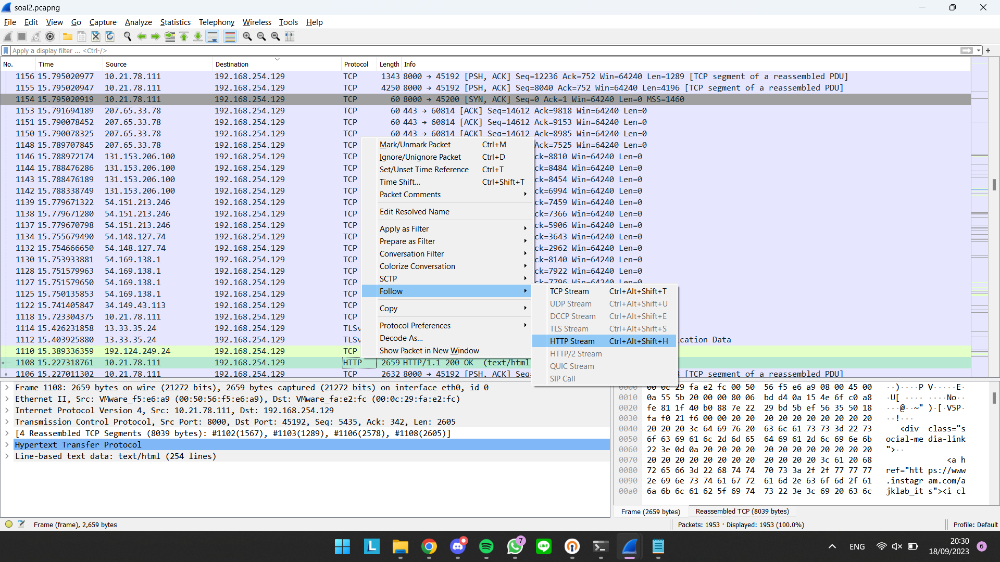
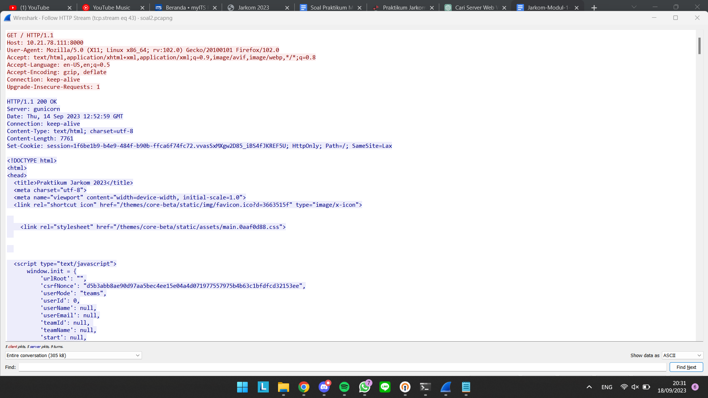
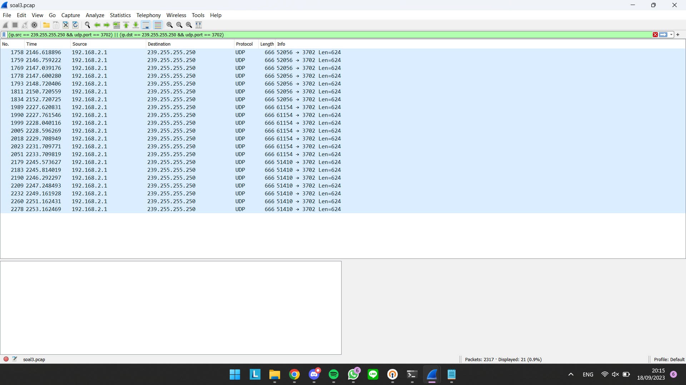
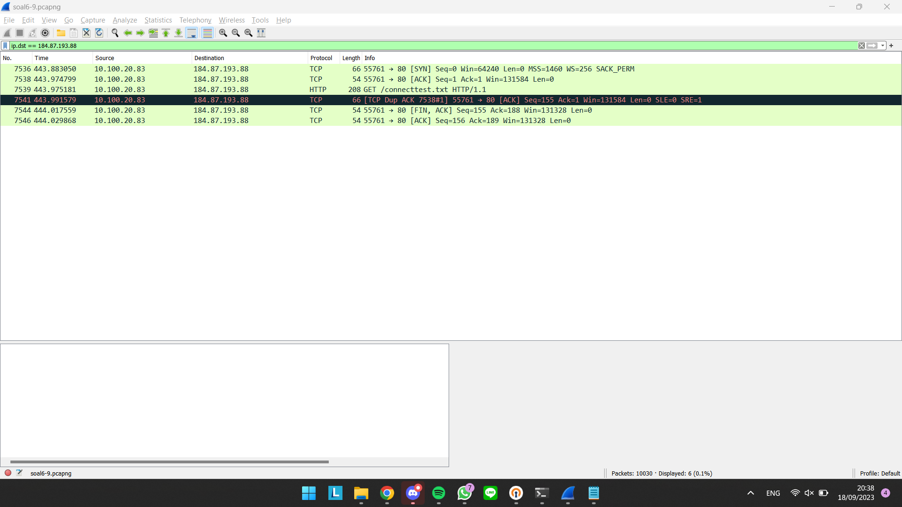
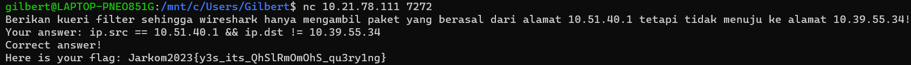
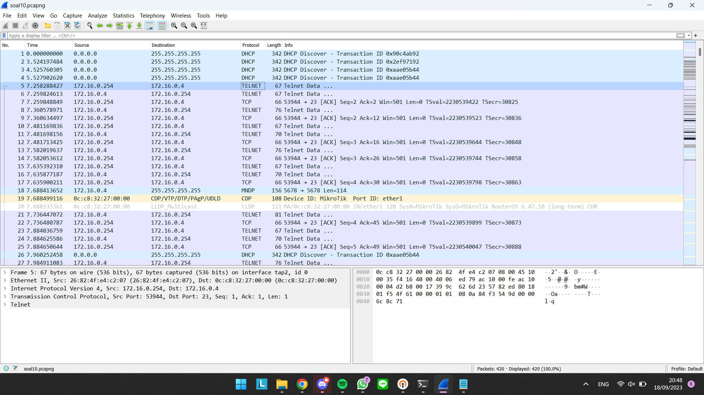
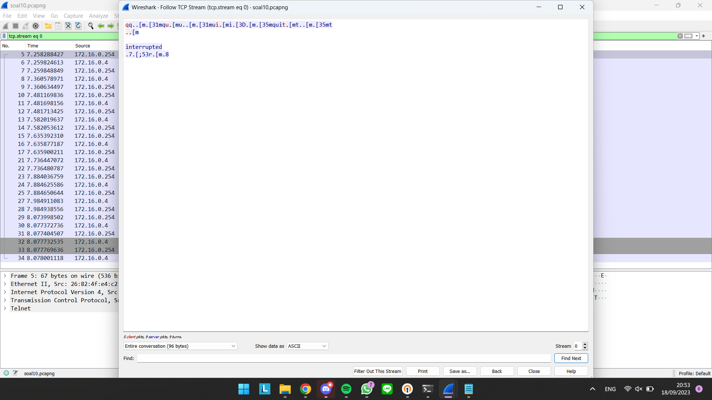
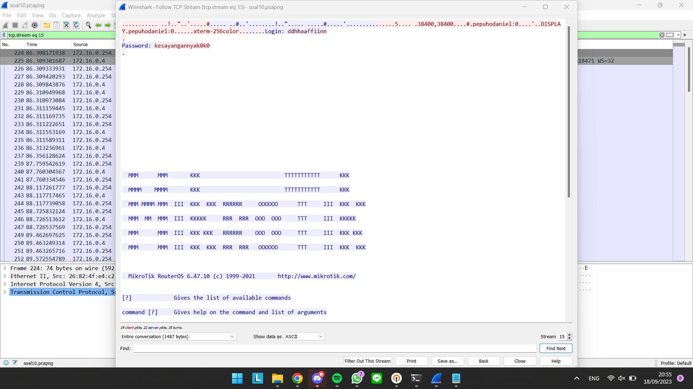

# # Jarkom-Modul-1-IT17-2023

Write-up atau laporan resmi dari modul pertama mata kuliah Komunikasi Data dan Jaringan Komputer IT ITS 2023.

## Authors

| NRP        | Nama                       |
| :--------  | :------------------------  |
| 5027211038 | Ahnaf Musyaffa             |
| 5027211056 | Gilbert Immanuel Hasiholan |

## Penjelasan

**Nomor 1**\
User melakukan berbagai aktivitas dengan menggunakan protokol FTP. Salah satunya adalah mengunggah suatu file.
* Berapakah sequence number (raw) pada packet yang menunjukkan aktivitas tersebut? 
* Berapakah acknowledge number (raw) pada packet yang menunjukkan aktivitas tersebut? 
* Berapakah sequence number (raw) pada packet yang menunjukkan response dari aktivitas tersebut?
* Berapakah acknowledge number (raw) pada packet yang menunjukkan response dari aktivitas tersebut?

**Nomor 2**\
Sebutkan web server yang digunakan pada portal praktikum Jaringan Komputer!\
Untuk soal ini, langkah pertama adalah untuk membuka terlebih dahulu file pcapng nya. Kemudian cari yang protokolnya HTTP dan di right click kemudian di follow HTTP seperti ini:\

Maka akan terbuka window baru yang menunjukkan hasil dari HTTP follow\

Dari isi kode tersebut, dapat dilihat bahwa terdapat satu baris yang tertulis `Server: gunicorn` yang juga merupakan jawaban dari pertanyaan.

**Nomor 3**\
Dapin sedang belajar analisis jaringan. Bantulah Dapin untuk mengerjakan soal berikut:\
**a.** Berapa banyak paket yang tercapture dengan IP source maupun destination address adalah 239.255.255.250 dengan port 3702?\
Untuk melihat hanya paket-paket yang sesuai dengan alamat IP dan port yang dicari dapat digunakan filter seperti ini\
`(ip.src == 239.255.255.250 && udp.port == 3702) || (ip.dst == 239.255.255.250 && udp.port == 3702)`\
di WireShark sehingga hasilnya seperti ini:

Kemudian untuk tahu banyak paketnya tinggal dihitung berapa paket yang ada setelah filter digunakan yaitu sebanyak 21\
**b.** Protokol layer transport apa yang digunakan?\
Dari kolom protokol dapat dilihat bahwa protokol layer transport yang digunakan adalah UDP.

**Nomor 4**\
Berapa nilai checksum yang didapat dari header pada paket nomor 130?

**Nomor 5**\
Elshe menemukan suatu file packet capture yang menarik. Bantulah Elshe untuk menganalisis file packet capture tersebut.
* Berapa banyak packet yang berhasil di capture dari file pcap tersebut?
* Port berapakah pada server yang digunakan untuk service SMTP?
* Dari semua alamat IP yang tercapture, IP berapakah yang merupakan public IP?

**Nomor 7**\
Berapa jumlah packet yang menuju IP 184.87.193.88?\
Untuk soal ini perlu menggunakan filter `ip.dst == 184.87.193.88`, sehingga pada wireshark hasilnya seperti ini

Kemudian dari situ dapat langsung dihitung saja jumlah paket yang ada, dan dalam kasus ini ada sebanyak 6 paket.

**Nomor 8**\
Berikan kueri filter sehingga wireshark hanya mengambil semua protokol paket yang menuju port 80! (Jika terdapat lebih dari 1 port, maka urutkan sesuai dengan abjad)

**Nomor 9**\
Berikan kueri filter sehingga wireshark hanya mengambil paket yang berasal dari alamat 10.51.40.1 tetapi tidak menuju ke alamat 10.39.55.34!\
Banyak ekspresi filter yang dapat digunakan untuk mendapatkan hasil yang sesuai seperti
* `ip.src == 10.51.40.1 and not ip.dst == 10.39.55.34` atau
* `ip.src == 10.51.40.1 && !(ip.dst == 10.39.55.34)`
Filter tersebut diinput sebagai jawaban sehingga flag dapat diberikan. Namun dalam kasus kelompok kami yang berhasil adalah\
`ip.src == 10.51.40.1 && ip.dst != 10.39.55.34`

**Nomor 10**\
Sebutkan kredensial yang benar ketika user mencoba login menggunakan Telnet!\
Pada pertama kali membuka file pcapng-nya akan muncul tampilan seperti ini

Disini kami mencoba untuk melakukan follow TCP untuk protokol TELNET dan mendapakan respons seperti ini:

Disini kami mengganti streamnya sampai yang terakhir yakni yang ke-15. Setiap iterasi stream memiliki username dan password yang berbeda. Namun untuk stream 15 sendiri memiliki format yang berbeda dengan yang lain dimana terdapat username dan password.

Pada stream 2 memiliki username dan password yang sama yakni `dhafin:kesayangannyak0k0`. Dan setelah diinput, jawabannya benar dan flag diberikan oleh sistem.